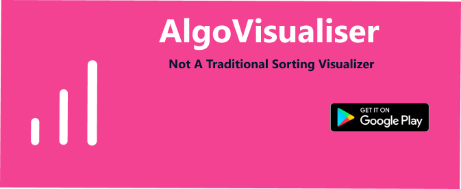

<p align = "center">
  <a href="https://play.google.com/store/apps/details?id=com.jivansh.algo_visual"></a>
</p>

# :bulb: The Idea Behind The App 

<h4 align="center">
AlgoViualizer picks up on where most sorting visualizers left off. Now visualize the 7 most famous sorting algorithms in tech, in  5 different colors and 3 awesome modes. Made purely in Flutter. Watch the video <a href = "https://www.youtube.com/watch?v=Ix_KsaIT0x0&ab_channel=JivanshSharma">here</a>
</h4>

## :eyes: Screens

<p align="center">
  
  
  
  
</p>

## :bar_chart: The Algorithims 

<p align="center">
  
  
  
</p>

<details>
<summary>Other algorithims</summary>
<br/>
<p align="center">
  
  
  
  
</p>
</details>

## :rainbow: Best Colors + Modes

<p align="center">
  
  
  
  
</p> 

## :computer: Tech Used

This project was developed with the following technologies:

- [Flutter](https://flutter.dev/)
- [Dart](https://dart.dev/)
- [Animated Icon Button](https://pub.dev/packages/animated_icon_button)
- [App Logo/Flutter Icons](https://pub.dev/packages/flutter_icons)
- [Figma](https://figma.com/) 
- [Android Studio](https://developer.android.com/studio/?gclid=Cj0KCQjw-af6BRC5ARIsAALPIlXC-_n8F-uSVjsBxiFbx9EGrdC7NguDndjGOgtQnYbqferF7JkOpjIaAs_jEALw_wcB&gclsrc=aw.ds)
- [VS Code](https://code.visualstudio.com/)


## :floppy_disk: Installing Locally

To run this application on your mobile device, you'll need [Git](https://git-scm.com), [Flutter 1.20+](https://flutter.dev/docs/get-started/install/windows), [Android 9(Pie)](https://www.android.com/versions/pie-9-0/)+ installed on your device. From your command line:

```bash
# Clone the repo
git clone https://github.com/parzuko/AlgoVisualizer
cd algo_visual

# Install dependencies
flutter pub get

# Run it on local/virtual device
flutter run
```

---

Made with ♥ by Jivansh Sharma :v: [Say Hi!](https://www.linkedin.com/in/jivansh/)
